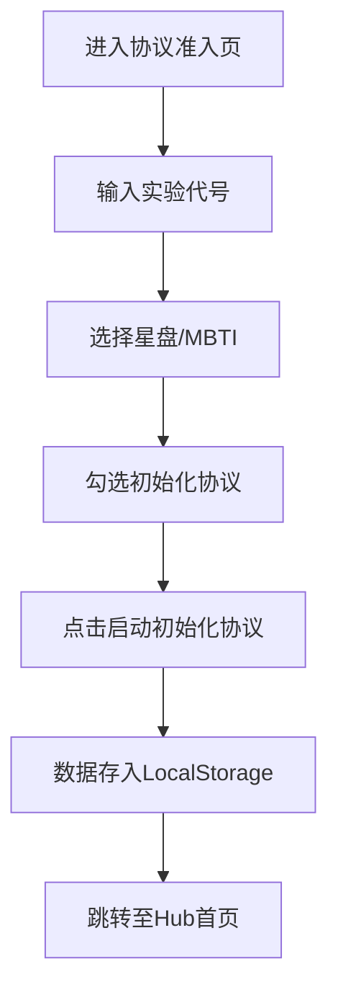
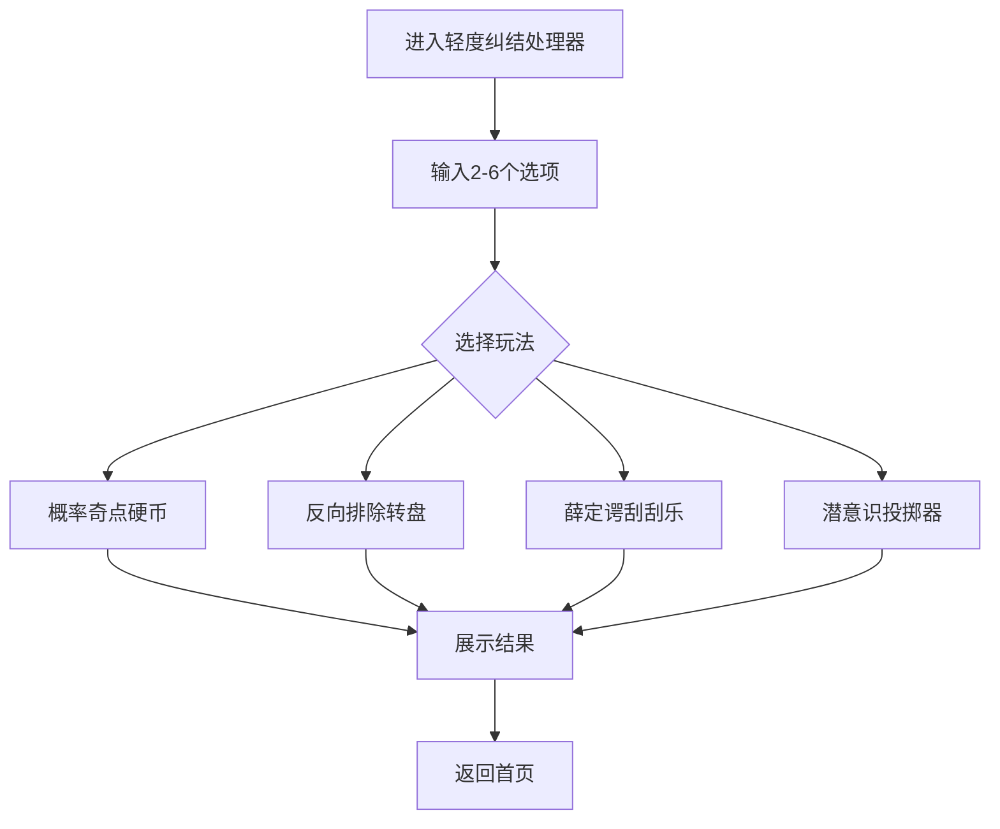
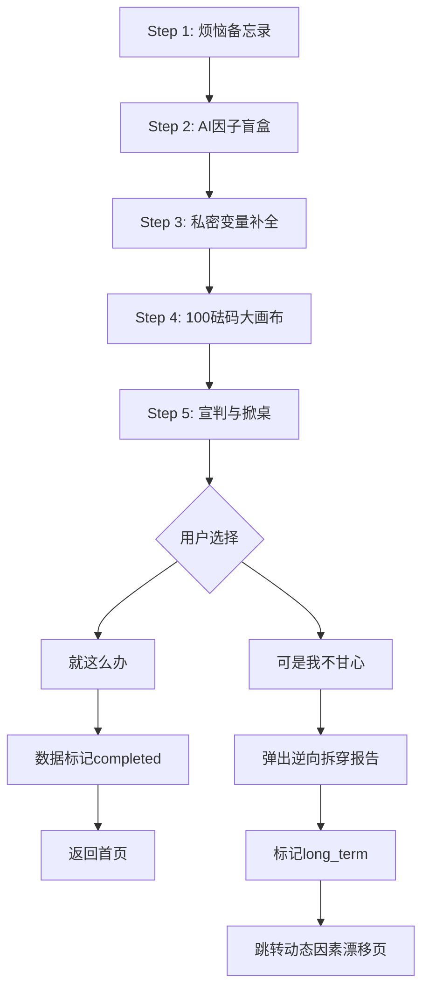
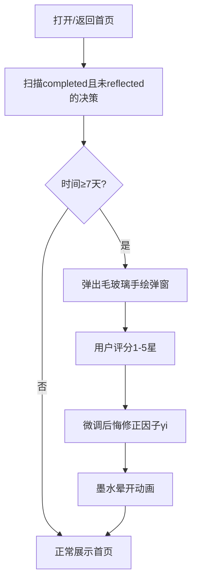

## 1. Product Overview

**纠结症自救实验室** - 一款帮助用户通过趣味交互和数据分析解决选择困难症的纯前端单页应用。

- 核心目标：通过游戏化的决策辅助工具，帮助用户在面对纠结选择时获得清晰的方向
- 目标用户：选择困难症患者、需要理性决策的职场人士、追求自我认知的年轻人
- 产品价值：将复杂的决策过程转化为有趣的游戏体验，同时通过数据追踪帮助用户了解自己的决策模式

## 2. Core Features

### 2.1 User Roles
| Role | Registration Method | Core Permissions |
|------|---------------------|------------------|
| 用户 | 本地注册（输入姓名、星盘、MBTI） | 使用所有决策工具、查看历史记录、生成人格报告 |

### 2.2 Feature Modules
1. **协议准入页**：用户注册与初始化协议
2. **轻度纠结处理器**：4种趣味决策小游戏（硬币、转盘、刮刮乐、投掷器）
3. **人生变量处理器**：AHP层次分析法深度决策流（5步引导式流程）
4. **动态因素漂移页**：决策因子权重时间序列可视化
5. **选择考古档案馆**：决策历史回溯与人格分析报告

### 2.3 Page Details
| Page Name | Module Name | Feature Description |
|-----------|-------------|---------------------|
| 协议准入页 | 用户注册 | 输入实验代号、星盘、MBTI，勾选初始化协议 |
| Hub首页 | 导航中心 | 展示4个模块入口，触发7天回溯提醒 |
| 轻度纠结处理器 | 趣味决策 | 4种Tab切换的小游戏交互 |
| 人生变量处理器 | 深度决策 | 5步Stepper卡片翻书流程 |
| 动态因素漂移页 | 数据可视化 | Recharts面积堆叠图展示权重漂移 |
| 选择考古档案馆 | 历史回溯 | 决策人格锚定报告 + 人生实验日志 |

## 3. Core Processes

### 3.1 用户注册流程

### 3.2 轻度决策流程

### 3.3 深度决策流程

### 3.4 决策反思拦截流程

## 4. User Interface Design

### 4.1 Design Style
- **主色调**：浅米白/灰白（#FDFBF7），带有淡蓝色网格线背景
- **边框风格**：粗黑、不规则手绘风格（border-2 border-black rounded-[4px] shadow-[4px_4px_0px_0px_rgba(0,0,0,1)]）
- **魔力核心色**：纯平高饱和度红色圆形（#FF4A4A），用于触发/确认按钮
- **字体风格**：标题使用手写感字体，正文使用Sans-serif
- **整体风格**：极简手绘草稿风/卡通蓝图风

### 4.2 Page Design Overview
| Page Name | Module Name | UI Elements |
|-----------|-------------|-------------|
| 协议准入页 | 注册表单 | 手绘网格纸卡片、手写体Logo、粗黑框输入框、手绘复选框、红色魔力按钮 |
| Hub首页 | 导航中心 | 4个模块入口卡片、7天回溯拦截弹窗 |
| 轻度纠结处理器 | 游戏区域 | 4个Tab卡片、手绘硬币/转盘/刮刮乐/投掷器交互元素 |
| 人生变量处理器 | Stepper流程 | 卡片翻书效果、因子盲盒、天平画布、拖拽砝码、宣判弹窗 |
| 动态因素漂移页 | 图表区域 | Recharts手绘风格面积图、变量撕扯警告条 |
| 选择考古档案馆 | 档案展示 | 牛皮纸文件夹入口、手绘档案单页、云裁判邀请函 |

### 4.3 Responsiveness
- 桌面优先设计，支持移动端自适应
- 卡片布局在小屏幕上自动堆叠
- 交互元素适配触摸操作

### 4.4 Animation Effects
- 按钮按压动效：位移2px，阴影缩减
- 硬币3D翻转动画（3秒）
- 墨水晕开/碎屑散落消散动画
- 卡片翻书Stepper效果
- 天平倾斜偏转动效
- 刮刮乐拉链哧啦效果
- 投掷器蓄力抖动进度条
